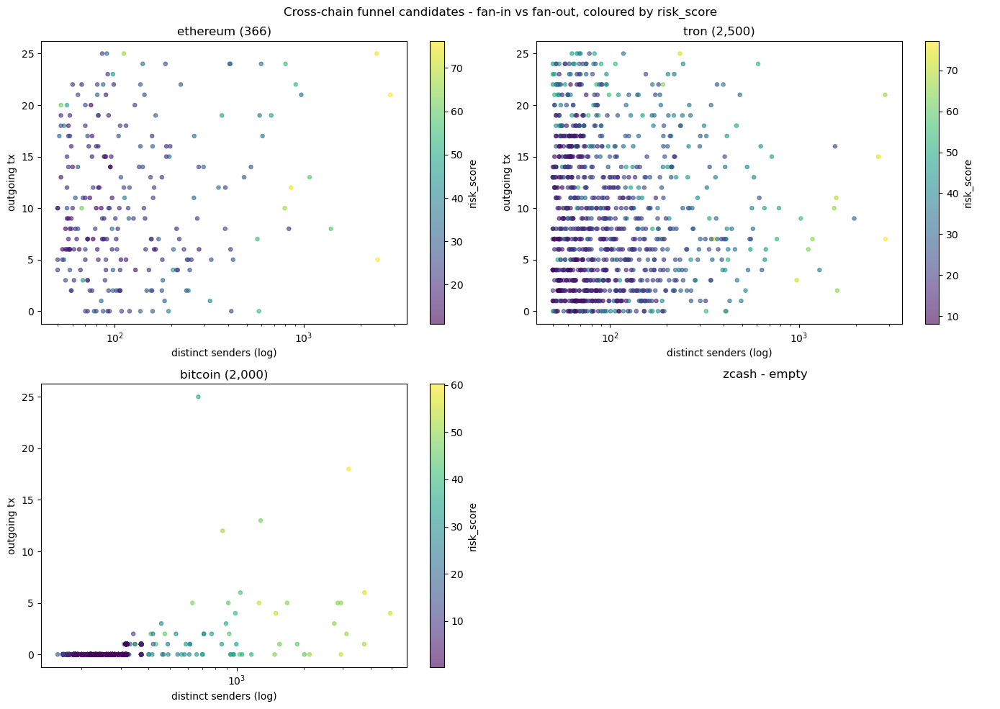
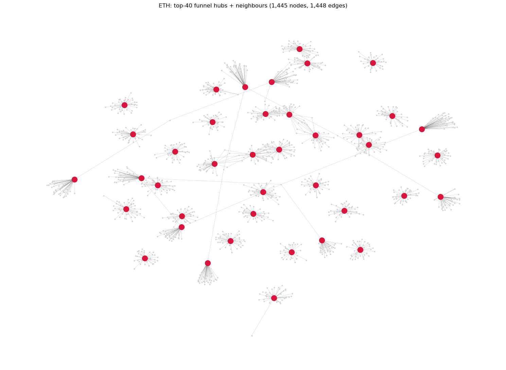
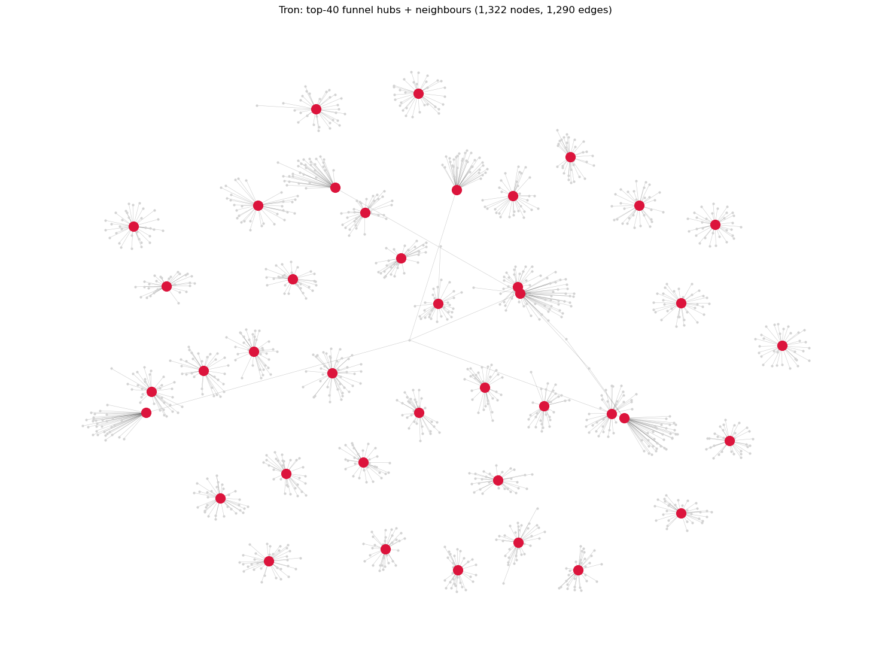
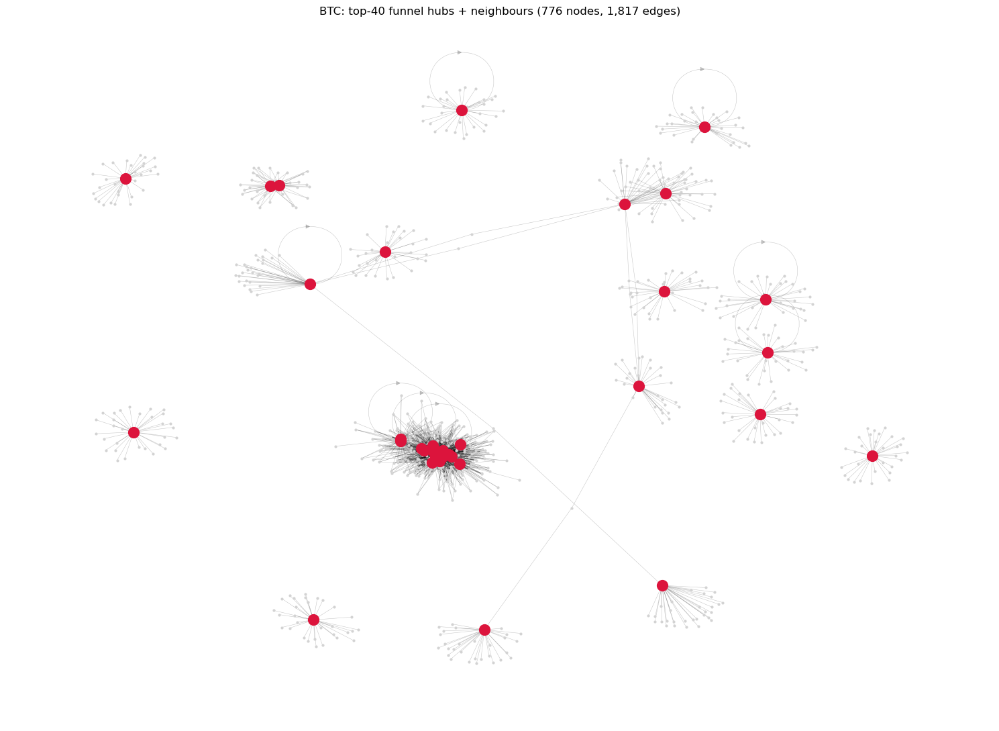

# Crypto-AML-Analysis

Data-science / ML research that surfaces, as **investigative leads**, independent/unregulated USDT
exchangers ("funnel accounts") and tests **counter-terror-financing (CTF)** proximity to OFAC-sanctioned
addresses - on **Ethereum (ERC-20)**, **Tron (TRC-20)**, **Bitcoin**, and **Zcash (transparent)** via
Google BigQuery public datasets.

Everything lives in **one self-contained notebook**: [`Crypto-AML-Analysis.ipynb`](Crypto-AML-Analysis.ipynb).

---

## From a reference run (July 2026)

A single top-to-bottom notebook run against the BigQuery public datasets produced:

| Chain | Window | Candidates | Reference cost |
|---|---|---|---|
| USDT-ERC20 (Ethereum) | 90 days | **374** EOAs | ~$0.28 |
| USDT-TRC20 (Tron) | 7 days | **2,519** | ~$0.02 |
| Bitcoin | 7 days | **2,000** (LIMIT capped, ordered by `funnel_signal`) | ~$0.04 |
| Zcash transparent | 30 days | 0 (expected - minimal transparent-funnel activity) | ~$0.00 |
| **Total suspicious wallets** | | **4,893** | **~$1.00 whole run** |

Of those, the pipeline surfaced:

| Signal | Count |
|---|---|
| Exchange-anchored (direct link to a labelled CEX -> KYC/subpoena target) | **85** |
| Behavioural CTF leads (per-chain top-25 by campaign score) | **75** |
| Bridge wallets (articulation points linking >=2 sub-networks) | see report |
| Co-funding operator clusters | **67** (largest = 1,534 funnels) |
| Chainalysis Sanctions Oracle hits on the top-368 ETH candidates | 0 |

---

## What it does

| Layer | Content |
|---|---|
| **Data** | BigQuery public datasets: `crypto_ethereum`, `goog_blockchain_tron_mainnet_us`, `crypto_bitcoin`, `crypto_zcash` + OFAC sanctioned list (via `0xB10C/ofac-sanctioned-digital-currency-addresses`) + community Etherscan labels + a starter NBCTF address file |
| **Detection** | High fan-in / low fan-out "funnel" candidates within a **human-scale band** ($10K–$2M inflow, ≤5,000 distinct senders), a **dust floor** (median per-transfer >= $50), and smart-contract filtering (EOAs only). Bitcoin uses a composite `funnel_signal` inside SQL so `LIMIT` chops the tail (weak signal), not the head |
| **Behavioural ranking** | Candidates ranked by an `informal_score` - depositor count, round-amount ratio, pass-through balance, and a human activity schedule (`hours_of_day_active`, `night_share`). Net accumulators (`pass_through < 0.5`) are flagged and excluded |
| **Graph + ML** | NetworkX directed graphs per chain (PageRank / degree / clustering), mixer/funnel heuristics, multi-hop OFAC proximity, Isolation-Forest risk score fit on the **candidate population** (not the full ~300K-node graph) so `risk_score` discriminates |
| **CTF** | OFAC-listed USDT addresses are frozen/dormant, so CTF signal comes from a **behavioural donation-campaign score** (`terror_signals.py`) plus a starter NBCTF address list (`data/nbctf_addresses.json` with `order` / `affiliation` / source URL per entry) |
| **Bridge wallets** | **Articulation points** across each chain's graph (`bridge_wallets.py`) - a single wallet whose removal disconnects >=2 sub-networks. Candidate common operator or nested exchanger |
| **Identity** | Co-funding clustering (group funnels by shared depositors), **nearest-exchange anchor promoted to a first-class `actionability` signal** (a funnel with a direct link to a labelled exchange is a concrete KYC/subpoena target), behavioural fingerprint (timezone), ENS resolution, and a **modular free-source enrichment layer** (`enrichment.py`: public labels + Chainalysis on-chain oracle + ENS) |
| **Geo** | Country overlay (`geo_tagging.py`) built from labelled-exchange countries and OFAC/NBCTF affiliation - highlights hits in a configurable interesting-country set (defaults: IL, IR, LB, SY, AE, RU, KP, YE). On-chain data has no country/IP; this is a coarse routing overlay, not physical location |
| **Triage** | Leads are the **per-chain top-K** by score, not a fixed threshold (which floods on Bitcoin); the master export is sorted by `actionability` = `risk_score` + exchange-anchor bonus |
| **Visualise** | Fan-in/fan-out scatter coloured by `risk_score`, per-chain hub-and-spoke network plots, and a **self-contained HTML triage report** (`report.html`) + a Streamlit dashboard for interactive drilldown |

---

## Visualising the output

### Cross-chain fan-in vs fan-out, coloured by risk_score

The bottom-right of each panel is the funnel signature: many distinct senders, few outgoing transactions.



### Per-chain hub-and-spoke networks (top-40 hubs + neighbours)

Crimson = top-40 funnel hubs by in-degree. Grey = their depositors and payout targets.

| Ethereum | Tron | Bitcoin |
|---|---|---|
|  |  |  |

---

## Sample actionable leads (top of the reference run's master output)

```
                                       wallet     chain  risk_score  actionability  anchor_exchange  anchor_usdt
0  0xad285fdedfc0d5f944a33e478356524293c7ec68  ethereum        68.1           93.1       Binance 15   several M
1  0x8b7710171181ec25ce9aa254eb074ec85559347b  ethereum        77.0           77.0                -             -
2  0x7af4a738b30775a836a050a4c85f4c58689aed38  ethereum        76.4           76.4                -             -
3  0x3f9a8ecc26db29f778634b4e84b07cde3eda319f      tron        75.5           75.5                -             -
4  0x61a8a99099a4d46124cf2914bd8eb8dfafd7c99d  ethereum        49.7           74.7       Binance 17             ...
5  0xbf8d7d490323d775ada8b20a35472acb7fc6a0c4  ethereum        48.3           73.3       Binance 16             ...
```

Row 0 is the ideal shape: a high-risk ETH funnel with a direct link to a labelled Binance deposit
address. The exchange holds the KYC, so this is a concrete subpoena target - `actionability` puts it
above pure-risk peers.

---

## Standalone HTML triage report

Notebook section 13.6 writes an offline `report.html` (no JS, no external assets) with:

- KPI header (candidates, exchange-anchored, bridge wallets, interesting-country hits, NBCTF hits)
- Top-50 actionable leads
- Bridge wallets table
- Country breakdown
- Exchange anchors
- Co-funding clusters
- NBCTF matches with `order` / `affiliation` / gov.il source URL

The same content is served interactively by `streamlit_app.py` with a Report tab that previews
`report.html` inline and offers a download button.

---

## Targeting

The detection is deliberately scoped to **human-operated, informal exchangers**. The `$10K–$2M` inflow
band and the `<=5,000` distinct-sender cap exclude institutional/CEX/OTC aggregators (wallets moving
tens to hundreds of millions), and candidates are ranked by behaviour rather than by raw size. Widen
`MAX_IN_USDT` / `MAX_DISTINCT_SENDERS` in the config cell to study the institutional tier instead.

---

## Quickstart

```bash
pip install -r requirements.txt
# then open the notebook
jupyter lab Crypto-AML-Analysis.ipynb
```

In the notebook's **Setup** cell, paste a BigQuery access token (`gcloud auth print-access-token`) into
`BQ_ACCESS_TOKEN`, or use `gcloud auth application-default login`, and set `BQ_PROJECT`. Run top to
bottom. Every query is **dry-run cost-estimated** and capped with `maximum_bytes_billed`; address-list
queries use parameterised `UNNEST(@addr)`, and results can be memoised to Parquet with `cached()` so
re-runs cost $0. Keep the `block_timestamp` partition filter to control cost.

To explore the results interactively:

```bash
streamlit run streamlit_app.py
```

The dashboard reads `suspicious_wallets_master.csv` (written by the notebook) plus any artifacts in
`outputs/`. Six KPIs at the top, sidebar filters for exchange-anchored / bridge-wallet / interesting-
country only, tabs for Candidates / Plots / Drilldown / Bridges / Geo / Report / Artifacts.

---

## Autonomous investigator layer

An optional layer on top of the detection pipeline (folder [`investigator/`](investigator/)) that keeps
running when the researcher's laptop is closed. The base project is untouched; the layer only reads it.

- **A ReAct investigator agent** over 7 budgeted tools (`graph_expand`, `enrich`, `detect_mixer`,
  `detect_bridge`, `search_ofac`, `search_nbctf`, `write_case_note`) that writes a cited markdown
  dossier per wallet under strict per-run budgets (BigQuery dollars, LLM tokens, hops, tool calls).
  Every claim in a dossier anchors to a `[TOOL:n]` observation in the reasoning trace.
- **Adaptive triage** - an online LinUCB reranker fed by analyst verdicts, warm-started weekly by an
  XGBoost pairwise LTR pass. Feature flag off -> queue stays on the static `actionability` order.
- **Autonomous delivery** - a GitHub Actions cron scan (twice a day) writes dossiers, publishes them to
  **GitHub Pages**, and pushes a digest to a **Telegram bot**. Runs with zero secrets on committed
  data; add secrets to turn it into a live BigQuery + LLM run. Detailed setup in Hebrew:
  [`investigator/SETUP_TELEGRAM.he.md`](investigator/SETUP_TELEGRAM.he.md).
- **Two-way Telegram bot** - poll-based (no webhook, no server): a second Actions workflow polls every
  5 minutes and responds to commands from the whitelisted chat.

  | Command | What it does |
  |---|---|
  | `/scan` | current top-3-per-chain digest |
  | `/top [chain] [N]` | top-N leads for one chain (default: ethereum, 10) |
  | `/wallet <address>` | details for one wallet from the master table |
  | `/stats` | dataset stats |
  | `/help` | list commands |

Full API + provider + LLM knobs are in [`investigator/README.md`](investigator/README.md).

---

## Responsible use

A high fan-in / low fan-out pattern, a mixer signature, a campaign-shaped inflow, a bridge-wallet
position, or an N-hop link to a sanctioned address are **research signals, not findings of guilt** -
they also fit legitimate processors, OTC desks, and exchange deposit wallets. Identity work produces
**entities and anchors**, never a real-world name; attribution to a person is for authorised enforcement
(subpoena to the exchange that holds the KYC).

**On the starter NBCTF list.** `data/nbctf_addresses.json` contains a small starter set of publicly
cited seizure-order addresses (each with an `order` reference, `affiliation`, and source URL). It is
**not authoritative** and **requires legal review** before operational use. Every match is a research
lead, not a determination.

**On IP / real-world attribution.** An IP address is *not* derivable from on-chain data - a ledger
records value flow, never the network origin of the broadcasting peer. Recovering it requires off-chain
infrastructure (listening nodes) or a licensed intelligence provider. The enrichment layer therefore
ships only **free, on-chain sources** by default; IP attribution is a documented, non-wired plug point
(`enrichment.IPAttributionSource`). Public on-chain data only; use authoritative OFAC designations for
seeds.
